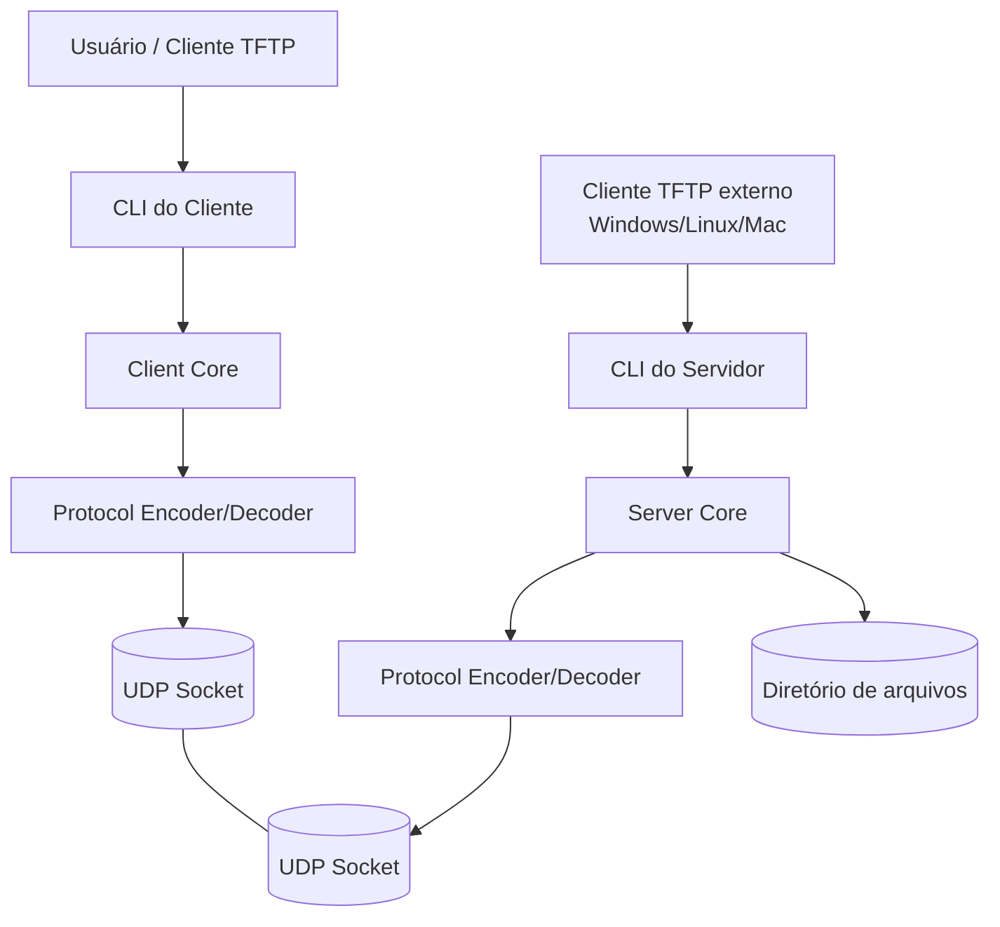

# TFTP Python CLI

Implementação acadêmica de cliente e servidor TFTP em Python, com interface de linha de comando, organização em pull requests, diagrama de componentes C4 e testes com clientes TFTP externos.

## Descrição da atividade

Esta atividade tem como objetivo estudar o protocolo TFTP (Trivial File Transfer Protocol), compreender o fluxo de trabalho com pull requests em Git, modelar a arquitetura do sistema por meio de diagramas C4 e implementar, em Python, um cliente e um servidor TFTP com interface CLI.

O projeto foi desenvolvido considerando:
- estudo do protocolo TFTP a partir da RFC 1350;
- adoção de boas práticas de codificação com PEP 8;
- uso de branches e pull requests para colaboração;
- testes com clientes TFTP externos em diferentes sistemas operacionais.

## Equipe

- João Lucas Noronha de Castro
- Juliana Ballin Lima
- Leonardo Castro da Silva
- Leonardo Melo Crispim
- Lucas Carvalho dos Santos
- Renato Barbosa de Carvalho
- Vinicius Souza Costa

## Visão geral do protocolo TFTP

O TFTP é um protocolo simples de transferência de arquivos baseado em UDP. Ele foi projetado para cenários leves, como bootstrap de dispositivos, envio de arquivos de configuração e transferência simples em redes locais.

Características principais:
- usa UDP;
- porta inicial 69 para requisições;
- suporta leitura (RRQ) e escrita (WRQ);
- transmite dados em blocos de até 512 bytes;
- usa ACK para confirmar cada bloco;
- encerra a transferência quando o último pacote DATA possui menos de 512 bytes.

## Diagrama C4 - Nível de Componentes



## Componentes do sistema

### 1. CLI do Cliente
Responsável por receber comandos do usuário no terminal, como operação desejada, endereço do servidor, porta e nome do arquivo.

### 2. Client Core
Implementa a lógica de envio de RRQ/WRQ, recepção de DATA/ACK e controle de timeout.

### 3. Protocol Encoder/Decoder
Responsável por montar e interpretar os pacotes TFTP:
- RRQ
- WRQ
- DATA
- ACK
- ERROR

### 4. CLI do Servidor
Inicializa o servidor, configura host, porta e diretório base para leitura e escrita.

### 5. Server Core
Gerencia as requisições dos clientes, valida arquivos e executa a lógica de leitura e escrita.

### 6. Diretório de arquivos
Armazena os arquivos servidos ou recebidos pelo servidor.

## Requisitos

- Python 3.10+
- Sistema operacional Windows, Linux ou macOS
- Git

## Instalação

```bash
git clone <url-do-repositorio>
cd tftp-python-cli
python -m venv .venv
source .venv/bin/activate
pip install -r requirements.txt
```

No Windows PowerShell:

```powershell
python -m venv .venv
.venv\Scripts\Activate.ps1
pip install -r requirements.txt
```

## Como executar o servidor

```bash
python server.py --host 0.0.0.0 --port 6969 --directory storage
```

## Como executar o cliente

### Fazer download de um arquivo do servidor
```bash
python client.py get --host 127.0.0.1 --port 6969 --remote sample.txt --local downloaded.txt
```

### Fazer upload de um arquivo para o servidor
```bash
python client.py put --host 127.0.0.1 --port 6969 --local sample.txt --remote uploaded.txt
```

## Testes com clientes TFTP externos

### Windows
O comando `tftp` do Windows suporta transferência de arquivos para/desde um servidor TFTP. Exemplo:

```powershell
tftp -i 127.0.0.1 GET sample.txt
tftp -i 127.0.0.1 PUT sample.txt
```

### Linux
Exemplo usando cliente TFTP/ATFTP:

```bash
tftp 127.0.0.1
get sample.txt
quit
```

ou

```bash
atftp --get --remote-file sample.txt --local-file test_linux.txt 127.0.0.1 6969
```

## Organização com pull requests

O desenvolvimento foi organizado por branches, permitindo que cada funcionalidade fosse revisada antes do merge para a branch principal.

Exemplo de branches:
- feat/server-read
- feat/server-write
- feat/client-read
- feat/client-write
- docs/readme-c4

## Exemplos de commits

- `feat: add tftp packet encoder and decoder`
- `feat: implement server rrq handling`
- `feat: implement client get command`
- `feat: implement client put command`
- `docs: add c4 component diagram to readme`
- `test: add protocol packet unit tests`

## Resultados esperados

- transferência de arquivos entre cliente e servidor desenvolvidos em Python;
- compatibilidade básica com clientes externos TFTP;
- documentação arquitetural do sistema;
- histórico de commits e pull requests no GitHub.

## Referências

- RFC 1350 - The TFTP Protocol (Revision 2)
- Artigo sobre Git Pull Request