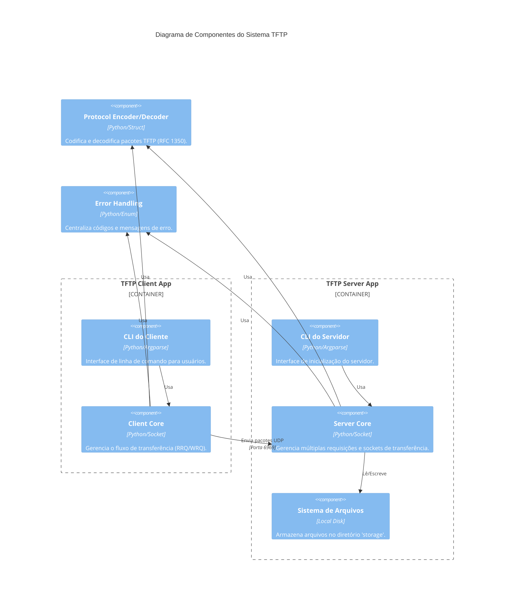
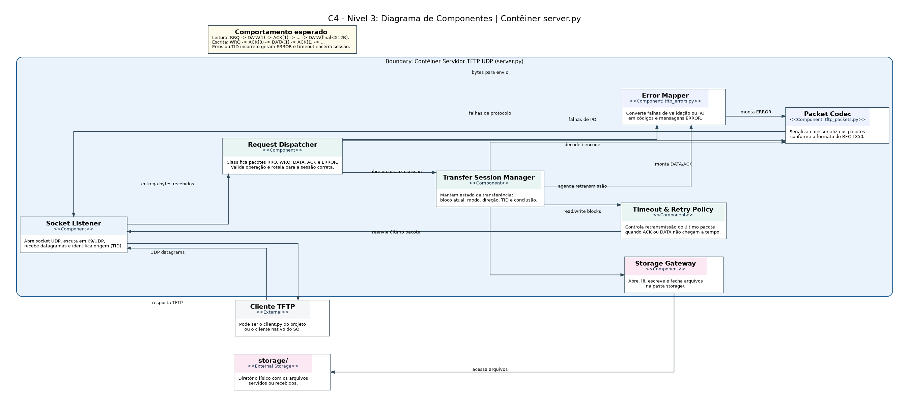

# 📦 TFTP Python CLI


Implementação acadêmica de cliente e servidor TFTP em Python, com interface de linha de comando, organização em pull requests, diagrama de componentes C4 e testes com clientes TFTP externos.

##  Descrição da atividade

Esta atividade tem como objetivo estudar o protocolo TFTP (Trivial File Transfer Protocol), compreender o fluxo de trabalho com pull requests em Git, modelar a arquitetura do sistema por meio de diagramas C4 e implementar, em Python, um cliente e um servidor TFTP com interface CLI.

O projeto foi desenvolvido considerando:
- 📚 estudo do protocolo TFTP a partir da RFC 1350;
- ✨ adoção de boas práticas de codificação com PEP 8;
- 🌿 uso de branches e pull requests para colaboração;
- 🧪 testes com clientes TFTP externos em diferentes sistemas operacionais.

##  Equipe

| Membro | Matrícula |
|--------|--------|
| 👤 João Lucas Noronha de Castro | 2315310009 |
| 👤 Juliana Ballin Lima | 2315310011 |
| 👤 Leonardo Castro da Silva | 2215310016 |
| 👤 Leonardo Melo Crispim | 2315310036 |
| 👤 Lucas Carvalho dos Santos | 2315310012 |
| 👤 Renato Barbosa de Carvalho | 2315310021 |
| 👤 Vinicius Souza Costa | 2315310024 |

## Uso de IA no Desenvolvimento

Este projeto utilizou IA (ChatGPT e DeepSeek) para auxiliar na revisão de código, sugestões de boas práticas, formatação de commits e documentação do README.

> **Nota**: Todo código gerado ou sugerido por IA foi revisado e testado pela equipe antes de ser integrado ao projeto.

##  Estrutura do Projeto

```
📦 tftp-python-cli
├── 📄 client.py                 # Cliente TFTP (GET/PUT)
├── 📄 server.py                 # Servidor TFTP (RRQ/WRQ)
├── 📄 tftp_packets.py           # Codificação/decodificação de pacotes
├── 📄 requirements.txt          # Dependências do projeto
├── 📄 .flake8                   # Configuração de lint
├── 📄 .gitignore                # Arquivos ignorados pelo Git
├── 📄 LICENSE                   # Licença do projeto
├── 📄 README.md                 # Documentação principal
├── 📁 tests/                    # Testes unitários
│   └── 📄 test_tftp_packets.py
│   └── 📄 test_client.py
├── 📁 storage/                  # Diretório de arquivos
│   └── 📄 .gitkeep
└── 📁 docs/                     # Documentação
    └── 📁 diagrams/              # Diagramas C4
        └── 📄 01_contexto.png
        └── 📄 02_containers.png
        └── 📄 03_componentes_servidor.png
        └── 📄 04_codigo.png               
```

## Visão geral do protocolo TFTP

O TFTP é um protocolo simples de transferência de arquivos baseado em UDP. Ele foi projetado para cenários leves, como bootstrap de dispositivos, envio de arquivos de configuração e transferência simples em redes locais.

### Características principais:
- 📡 usa UDP;
- 🔌 porta inicial 69 para requisições;
- 📖 suporta leitura (RRQ) e escrita (WRQ);
- 📦 transmite dados em blocos de até 512 bytes;
- ✅ usa ACK para confirmar cada bloco;
- 🏁 encerra a transferência quando o último pacote DATA possui menos de 512 bytes.

## Diagrama C4 - Nível de Componentes




## Componentes do sistema

### 1. 💻 CLI do Cliente
Responsável por receber comandos do usuário no terminal, como operação desejada, endereço do servidor, porta e nome do arquivo.

### 2. ⚙️ Client Core
Implementa a lógica de envio de RRQ/WRQ, recepção de DATA/ACK e controle de timeout.

### 3. 📦 Protocol Encoder/Decoder
Responsável por montar e interpretar os pacotes TFTP:
- RRQ (Read Request)
- WRQ (Write Request)
- DATA (Data packet)
- ACK (Acknowledgment)
- ERROR (Error packet)

### 4. 💻 CLI do Servidor
Inicializa o servidor, configura host, porta e diretório base para leitura e escrita.

### 5. ⚙️ Server Core
Gerencia as requisições dos clientes, valida arquivos e executa a lógica de leitura e escrita.

### 6. 📁 Diretório de arquivos
Armazena os arquivos servidos ou recebidos pelo servidor.

##  Requisitos

- 🐍 Python 3.10+
- 💻 Sistema operacional Windows, Linux ou macOS
- 🌿 Git

##  Instalação

```bash
# Clone o repositório
git clone <url-do-repositorio>
cd tftp-python-cli

# Crie e ative o ambiente virtual
python -m venv .venv
source .venv/bin/activate  # Linux/Mac

# No Windows PowerShell:
# .venv\Scripts\Activate.ps1

# Instale as dependências
pip install -r requirements.txt
```

## Como executar

### Servidor
```bash
python server.py --host 0.0.0.0 --port 6969 --directory storage
```

### Cliente - Download (GET)
```bash
python client.py get --host 127.0.0.1 --port 6969 --remote sample.txt --local downloaded.txt
```

### Cliente - Upload (PUT)
```bash
python client.py put --host 127.0.0.1 --port 6969 --local sample.txt --remote uploaded.txt
```

## Como Testar (Passo a Passo)

### 1. Preparação
Certifique-se de que as dependências estão instaladas:
```bash
pip install -r requirements.txt
```

### 2. Iniciar o Servidor
Abra um terminal e execute:
```bash
python server.py --host 127.0.0.1 --port 6969 --directory storage
```

### 3. Testar Download (GET)
Em outro terminal, crie um arquivo no servidor e tente baixá-lo:
```bash
# Criar arquivo no servidor
echo "Teste de download" > storage/test_get.txt

# Baixar usando nosso cliente
python client.py get --host 127.0.0.1 --port 6969 --remote test_get.txt --local baixado.txt

# Verificar conteúdo
type baixado.txt  # Windows
cat baixado.txt   # Linux/Mac
```

### 4. Testar Upload (PUT)
Crie um arquivo local e envie para o servidor:
```bash
# Criar arquivo local
echo "Teste de upload" > para_enviar.txt

# Enviar usando nosso cliente
python client.py put --host 127.0.0.1 --port 6969 --local para_enviar.txt --remote enviado.txt

# Verificar se chegou no servidor
type storage\enviado.txt  # Windows
cat storage/enviado.txt   # Linux/Mac
```

### 5. Testar com Cliente TFTP do Windows
Certifique-se de que o "Cliente TFTP" está ativado nos "Recursos do Windows".
```powershell
tftp -i 127.0.0.1 GET test_get.txt windows_get.txt
```

## Testes unitários

### Executar testes unitários
```bash
pytest tests/ -v
```

### Verificar cobertura
```bash
pytest --cov=. tests/ --cov-report=term-missing
```

### Verificar estilo de código
```bash
flake8 .
black --check .
```

## Testes com clientes TFTP externos

### Windows 🪟
```powershell
tftp -i 127.0.0.1 GET sample.txt
tftp -i 127.0.0.1 PUT sample.txt
```

### Linux 🐧
```bash
# Usando cliente tftp
tftp 127.0.0.1
get sample.txt
quit

# Usando atftp
atftp --get --remote-file sample.txt --local-file test_linux.txt 127.0.0.1 6969
```

### macOS 🍎
```bash
tftp 127.0.0.1
get sample.txt
quit
```

## Organização com pull requests

### Padrão de branches
Utilizamos o padrão [Conventional Commits](https://www.conventionalcommits.org/) para nomeação de branches:

| Prefixo | Descrição | Exemplo |
|---------|-----------|---------|
| `feat/` | Nova funcionalidade | `feat/client-get` |
| `fix/` | Correção de bug | `fix/packet-timeout` |
| `docs/` | Documentação | `docs/update-readme` |
| `test/` | Testes | `test/add-coverage` |
| `refactor/` | Refatoração | `refactor/packet-encoder` |

### Branches do projeto
- `main` - branch principal e estável
- `feat/initial-structure` - estrutura inicial do projeto (Juliana)
- `feat/packet-encoding-decoding` - implementação dos pacotes (Juliana)
- `feat/client-get` - cliente download (João Lucas)
- `feat/client-put` - cliente upload (Lucas Carvalho)
- `feat/server-read` - servidor leitura (Leonardo Castro)
- `feat/server-write` - servidor escrita (Leonardo Melo)
- `feat/error-handling` - tratamento de erros (Renato)
- `test/unit-tests` - testes expandidos (Vinicius)

### Fluxo de trabalho
```bash
# 1. Criar branch a partir da main
git checkout main
git pull origin main
git checkout -b feat/sua-funcionalidade

# 2. Implementar e commitar
git add .
git commit -m "feat: implement xyz"

# 3. Enviar e criar Pull Request
git push origin feat/sua-funcionalidade
# Abrir PR no GitHub para review
```

## Exemplos de commits

```
✨ feat: add tftp packet encoder and decoder
🐛 fix: allow empty error messages in ERROR packets
📚 docs: add c4 component diagram to readme
🧪 test: add protocol packet unit tests
♻️ refactor: simplify packet decoding logic
🔧 chore: update dependencies in requirements.txt
```

## 📚 Referências

- [RFC 1350 - The TFTP Protocol (Revision 2)](https://datatracker.ietf.org/doc/html/rfc1350)
- [Git Pull Request - GeeksforGeeks](https://www.geeksforgeeks.org/git/git-pull-request/)
- [Conventional Commits](https://www.conventionalcommits.org/)
- [PEP 8 - Style Guide](https://www.python.org/dev/peps/pep-0008/)

## 📄 Licença

Este projeto está sob a licença MIT. Veja o arquivo [LICENSE](LICENSE) para mais detalhes.

---

<div align="center">
  Desenvolvido para fins acadêmicos - Universidade do Estado do Amazonas (UEA)
</div>
```
